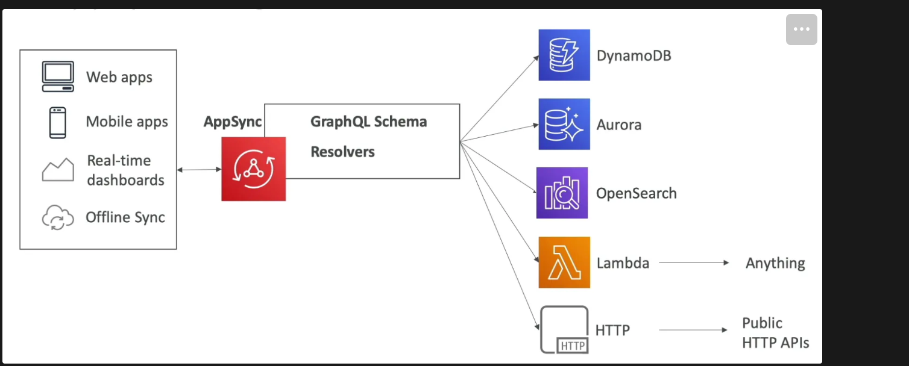

## Intro
- AWS managed service that uses **GraphQL**
- Need to upload a GraphQL schema to AppSync
- Integrated with CloudWatch for logging
- Integrated with X-Ray for Tracing

- GraphQL responses may include data from one or more sources (NoSQL DB, SQL DB, other APIs)
- Optional caching functionality to reduce load on the data source
- **Resolvers have direct integration with DynamoDB, Aurora and OpenSearch**.
- Lambda function can be used to get data from any source.
- Resolvers can fetch data from other HTTP APIs as well.
- **Retrieve data in real-time** with **WebSocket** or **MQTT** on WebSocket
- **Offline data synchronization** in mobile devices

## Security

- **To get HTTPS on AppSync with a custom domain, use CloudFront in front of AppSync**
- 4 ways to authorize applications to interact with AppSync GraphQL API:
    - `API_KEY` - generate an API key and give it to the customer
    - `AWS_IAM` - authorize IAM users or roles / **cross-account access**
    - `AMAZON_COGNITO_USER_POOLS` - AWS managed IDP for external users
    - `OPENID_CONNECT` - 3rd party OIDC compatible IDP for external users