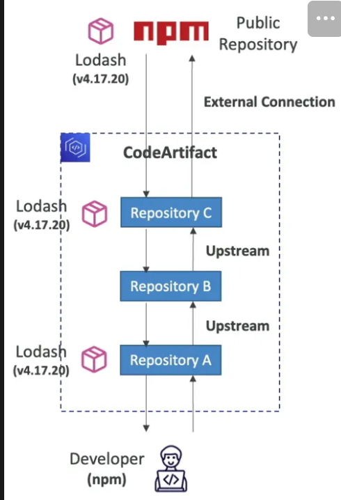
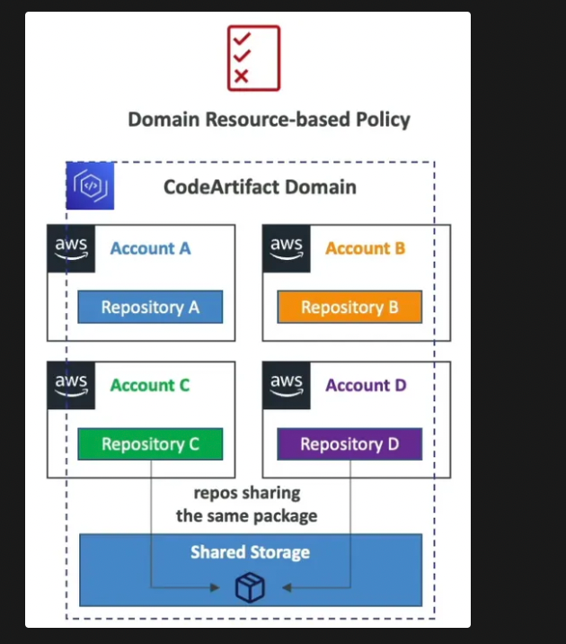

# CodeArtifact
- AWS Own artifactory
- Works with common dependency management tools such as Maven, Gradle, npm, yarn, twine, pip and NuGet
- Artifacts are all accessed inside the vpc only
- `Custom artifacts can also be hosted on CodeArtifact`
### Eventbridge Integration To Trigger Pipelines:
- CodeArtifact Events (such as a version of a package is created, modified, deleted) will emit events to EventBridge
- These events can be input for Lambda, SNS, SQS or they can trigger CodePipeline
### Cross Account Access and Access Management
- Resource policy are there to give access for cross account access.
- A given principal will either have access to read all the artifacts and access them or None of them.
- You cannot give granular level access to the particular artifacts that particular dev/sre requires.

### External Connections
- Used to fetch the packages from other repository which we do not have on our own codeartifact such as Maven central, npm, NuGet etc.
- We can have atmax 1 external connection to another repository.

### Retention
- If a requested package (artifact) is found in an upstream repo, a reference to it is stored in the downstream repo closest to the developer (who requested the package).
- If the package is fetched from a public repo, a reference to it will be stored in the repo connected to the external repo.
- Intermediate repositories do not keep the package. Example: A -> B -> C -> npm; if B and C do not have a version requested by A, the downloaded version will be retained only in A (not in B and C)

### Domains

- Single shared storage for all the repositories across multiple accounts.
- **De-duplicated storage**: Artifacts are stored only once in the shared storage of the domain and repositories only store references(address) to these artifact. The artifacts are not duplicated across repositories. These child repos fetch the artifact from a single shared repo for all the accounts.
- **Fast copying**: when a repository pulls an artifact from an upstream repository, it only copies the metadata (containing the reference to the artifact stored in the domain). The artifact stays on the upstream repo till it is actually required during a build and when it is fetched it is cached on the downstream repo also.
- Example:
    - Let's say you have an upstream repository repo-A where a library (e.g., my-lib-1.0.0.jar) is stored. If you want a downstream repository repo-B to use this artifact, instead of copying the entire my-lib-1.0.0.jar file, CodeArtifact only copies the metadata about the artifact to repo-B.
    - When a build or deployment in repo-B requests the artifact, AWS CodeArtifact will fetch it from repo-A if needed. If the artifact is already cached locally in repo-B, CodeArtifact can directly use it without re-fetching from the upstream repository.
- **Easy sharing across repositories and teams**: all the assets and the metadata in a domain are encrypted with a single KMS key

- **Domain Resource-based Policy**: domain administrator can apply policy across the domain such as:
    - Restricting which accounts have access to repositories in the domain
    - Who can configure connections to public repositories to use as sources of packages

