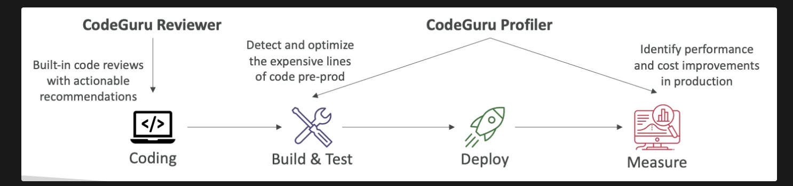

- An ML-powered service for **automated code reviews** and **application performance recommendations**
- Provides two functionalities
    - **CodeGuru Reviewer**: automated code reviews for static code analysis when the code is pushed to CodeCommit in **development**
    - **CodeGuru Profiler**: visibility and recommendations about application performance during
    runtime in **production**

### CodeGuru Agent

- **CodeGuru Profiler** works by running CodeGuru Agent alongside the application
- Configurations:
    - `MaxStackDepth` - max function stack depth profiled
        Example: If CodeGuru Profiler finds a method A, which calls method B, which calls
        method C, which calls method D, then the depth is 4. So, if the MaxStackDepth is set to 2, then the profiler evaluates A and B.
    - `MemoryUsageLimitPercent` - max memory percentage used by the profiler
    - `MinimumTimeForReportingInMilliseconds` - min time between sending reports
    - `ReportinglntervalInMilliseconds` - time interval between sending reports
    - `SamplingIntervallnMilliseconds` - the sampling interval that is used to profile
    samples (reduce to have a higher sampling rate)