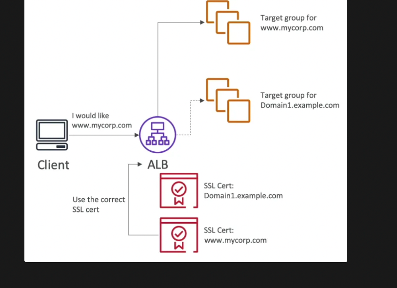

# Elastic Load Balancer
- Regional service
- Health checks allow ELB to know which instances are working properly (done on a port and a route, /health is common)
- Does not support weighted routing
### Classic Load Balancer
- Older variant of LB
- Can redirect traffic to a single application 
- Support HTTP, HTTPS and TCP
- Does not support websockets.
- Provides a fixed hostname for the load balancer.

### Application Load Balancer
- Operats at layer 7
- fixed hostname given to the load balancer
- Can redirect traffic to docker containers or ecs also.
- Can redirect traffic to `lambda` also
- Client info is passed in the request headers
    - Client IP ⇒ `X-Forwarded-For`
    - Client Port ⇒ `X-Forwarded-Port`
    - Protocol ⇒ `X-Forwarded-Proto`
#### Health Checks
- EC2 instances - HTTP
- ECS tasks - HTTP
- Lambda functions - HTTP request is translated into a JSON event
- Private IP Addresses
- When the target type is IP, you can specify private IP addresses only.
#### Traffic Redirection
##### Instance ID Targeting: 
- Routes to Primary IP: When you specify an instance ID, ALB routes the traffic to the primary private IP address of the instance’s primary ENI.
- Use Case: This is useful when you want the ALB to route traffic to an EC2 instance directly, and the instance only needs one application or service.
##### IP Address Targeting:
- Routes to Any Private IP: When you register IP addresses, ALB can route traffic to any private IP address on the EC2 instance, including secondary IPs on additional network interfaces (ENIs). This allows for multiple services or applications to run on a single EC2 instance, each listening on different ports or interfaces.
- Use Case: This is useful in scenarios where you need to route traffic to multiple applications or services on the same instance, or if you're managing non-EC2 targets (like on-premises servers) and need fine-grained control over traffic routing.

### Network Load Balancer
- Operates at layer 4(TCP and UDP)
- Millions of requests per second supported
- Lower latency compared to ALB
- Static Public IP is given to this load balancer in ALB and CLB a static hostname is given.
    - This static ip is unique per AZ.
- Elastic IP can be assigned to NLB (helpful for whitelisting specific IP)
- No security groups can be attached to NLBs. Since they operate on layer 4, they cannot see the data available at layer 7. They just forward the incoming traffic to the right target group as if those requests were directly coming from client. So, the target instances must allow TCP traffic on port 80 from anywhere.
- Within a target group, NLB can send traffic to
    - **EC2 instances**
        - If you specify targets using an instance ID, traffic is routed to instances using the **primary private IP address**
    - **IP addresses**
        - Used when you want to balance load for a physical server having a static IP.
    - **Application Load Balancer (ALB)**
        - Used when you want a static IP provided by an NLB but also want to use the features provided by ALB at the application layer.
### Gateway Load Balancer (GWLB)

- Operates at layer 3 (Network layer) - IP Protocol
- Used to route requests to a fleet of 3rd party virtual appliances like Firewalls, Intrusion Detection and Prevention Systems (IDPS), etc.
- Performs two functions:
    - **Transparent Network Gateway** (single entry/exit for all traffic)
    - Load Balancer (distributes traffic to virtual appliances)
- Uses `GENEVE` protocol
- Target groups for GWLB could be
    - EC2 instances
    - IP addresses
### Sticky Sessions
- **Only supported by CLB & ALB** because the cookie can be seen at layer 7
- Cookies could be
    - **Application-based** (TTL defined by the application)
    - **Load Balancer generated** (TTL defined by the load balancer)
- ELB reserved cookie names (should not be used)
    - `AWSALB`
    - `AWSALBAPP`
    - `AWSALBTG`

### Cross Zone Load Balancing
- Allows ELBs in different AZ containing unbalanced number of instances to distribute the traffic evenly across all instances in all the AZ registered under a load balancer.
- Supported Load Balancers
    - Classic Load Balancer
        - Disabled by default
        - No charges for inter AZ data
    - Application Load Balancer
        - Always on (can’t be disabled)
        - No charges for inter AZ data
    - Network Load Balancer
        - Disabled by default
        - Charges for inter AZ data

### **Server Name Indication (SNI)**
- SNI allows us to load multiple SSL certificates on one Load Balancer to serve multiple websites securely
- **Only works for ALB & NLB** (CLB only supports one SSL certificate)
- Newer protocol, not every client supports it yet
- **Supported in CloudFront** also

### Connection Draining (De-registration Delay)

- When an instance is to be de-registered from the ELB, the in-flight requests being served by that instance are given some pre-defined time to complete before the ELB de-registers it.
- ELB stops sending new requests to the EC2 instance which is de-registering
- Set manually (0 to 3600 seconds) (**default: 300 seconds**)

💡 For instances behind an ELB and using ASG, increase the de-registration delay to ensure that the in-flight requests are completed before the ELB deregisters an instance which is to be terminated by the ASG.
